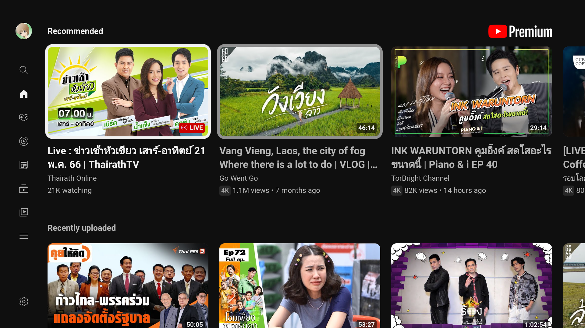
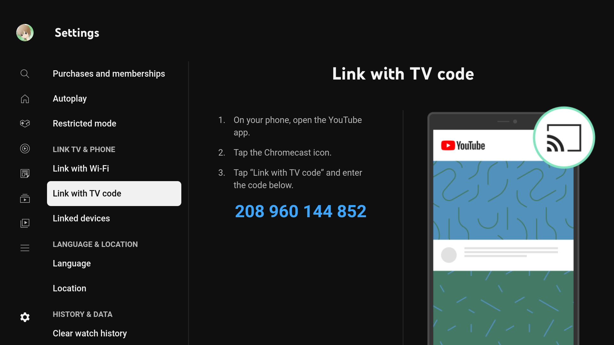

# YoutubeTV Wrapper
- Electron youtube tv wrapper

# Getting Started
1) run 'npm install' to download dependencies
2) run 'npm start' to test locally
3) run 'npm dist' to build

# Dependencies
- Node
- Electron
- Electron-Builder

# Note
- Support Cast by 'Link with TV code'

